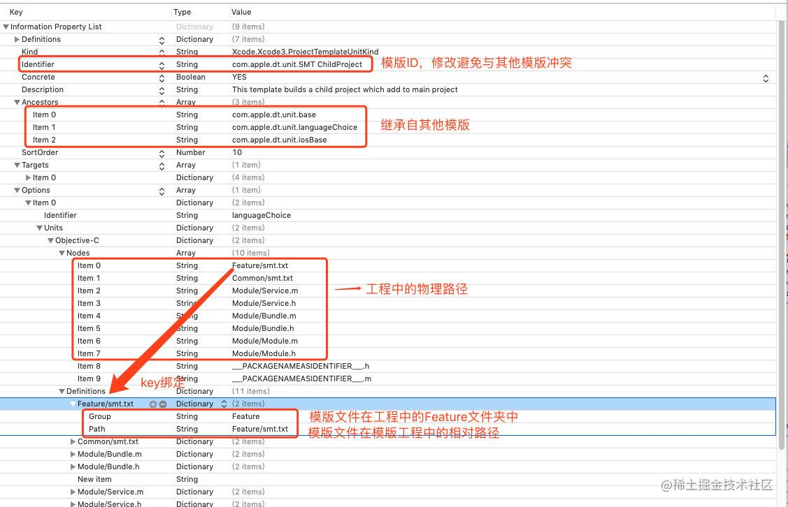
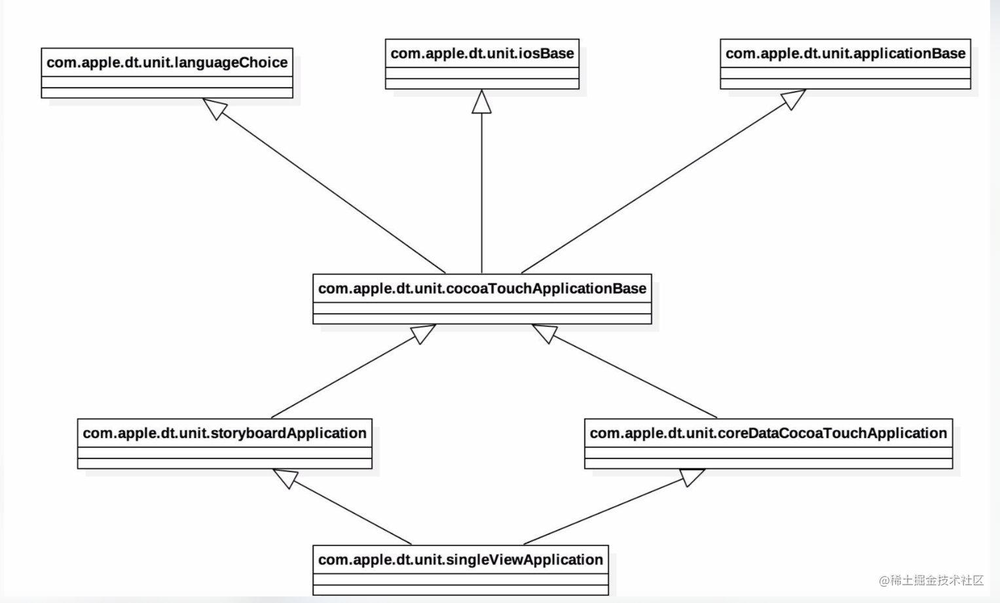

# Readme

## 模版信息
1. ios 平台下 Application 组的模版位置：
   + ```/Applications/Xcode.app/Contents/Developer/Platforms/iPhoneOS.platform/Developer/Library/Xcode/Templates/Project Templates/iOS/Application```
     - 其中有很多类型的子工程，如 ```App.xctemplate``` 等
2. ios 平台下类文件模版位置：
   + ```/Applications/Xcode.app/Contents/Developer/Platforms/iPhoneOS.platform/Developer/Library/Xcode/Templates/File Templates/iOS/Source```
     - 其中有很多类型，如 ```UIViewSwift``` 等
3. 模版中的占位符
    占位符 | 意义
    --- | ---
    ```___FILENAME___``` | 当前的文件名
    ```___PROJECTNAME___``` | 当前工程名，在创建工程时设置的
    ```___FILEBASENAME___``` | 文件名
    ```___FILEBASENAMEASIDENTIFIER___```| 不包含后缀的c格式文件名
    ```___VARIABLE_cocoaTouchSubclass___``` | 继承的父类名字
    ```___FULLUSERNAME___``` | 用户名
    ```___ORGANIZATIONNAME___``` | 公司名
    ```___COPYRIGHT___``` | 版权说明
    ```___DATE___``` | 当前日期，格式为MM/DD/YY
    ```___TIME___``` | 当前时间
    ```___YEAR___``` | 当前年
    ```___FILEHEADER___``` | 默认类的头文件


## 自定义工程
### 修改 TemplateInfo.plist
1. 首先要修改下```Identifier```字段，以防冲突
2. 新增文件配置： 

**其中**，每个```Options```下的 Item 都对应一个 新建工程时的选项组合，需要根据实际情况修改某个或某些组合下的```Nodes```和```Definitions```

3. 系统图标名为 TemplateIcon，的大小为48x48（二倍图为96x96），大小不同也可以

### 说明
Xcode模板是支持继承的，或者叫做Import，这里Ancestors字段以数组的方式列出了要继承的对象，上面只继承com.apple.dt.unit.cocoaTouchApplicationBase，这个是和Xcode6一起的Empty工程类似的。

各个模版的关系如下：

## 自定义类
类似自定义工程...


## Reference
- [在 Xcode 中自定义快捷模板](https://www.jianshu.com/p/1ce9a08220d8)
- [iOS 高效开发之 - 3分钟实现自定义 Xcode 初始化的模板](https://juejin.cn/post/6882678008415518734)