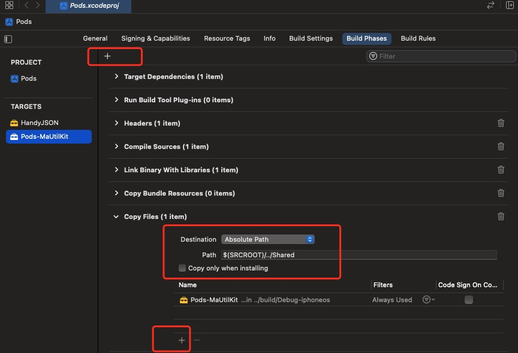

#  README

## Q & A
- 运行 iOS 测试 app 提示不受信任的开发者
    + 在```设置-通用-描述文件列表```中，找到你的帐号，选择信任即可
- 开发 MaUtilKit 时可以通过以下方式引入：
    + 左侧导航栏选中项目 -> 右侧配置项："Build Phasees"
        + 对于 Pod 工程，选中 TARGETS 中的 "Pod-xxx" -> 新增配置项 "Copy Files"
            - 
            - ```Destination: Absolute Path
                 Path: $(SRCROOT)/../Shared
                 通过 + 号，添加编译产物目录 "Pod-xxx" ```
    + 打开用于开发的 xcodeproj 工程文件，并在其中引入 拷贝到 Shared 目录的 "Pod-xxx"
        + ```TARGET -> General -> Frameworks and Libraries -> Add Others```
    + 待 MaUtilKit 开发完成，再将 IosScaffold 对其的引用方式更改为标准第三方 frame 引用即可
