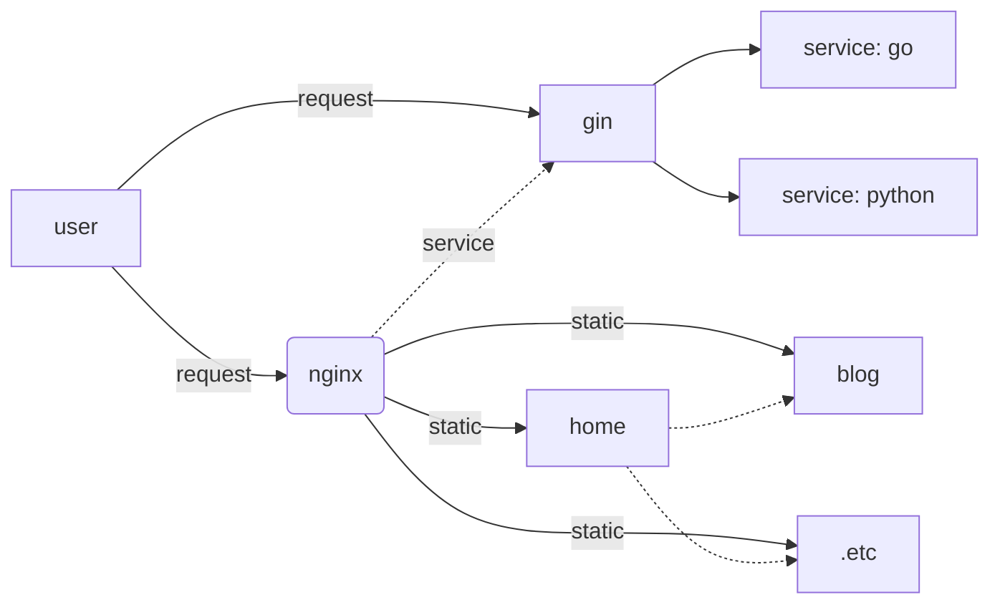

# Runtime Environment

## Architecture


## Directory Structure
```
/data/www/:
    ├── envs
    │   ├── biz
    │   │   ├── docker-compose.biz.yaml
    │   │   └── dockfile.biz-server
    │   ├── crts
    │   │   ├── domain.key
    │   │   └── domain_bundle.crt
    │   ├── env
    │   │   ├── docker-compose.env.yaml
    │   │   ├── nginx.conf
    │   │   └── nginx.wordpress.conf
    │   └── wordpress
    |       └── ...
    ├── myapp
    │   ├── blog
    |   │   └── ...
    │   ├── krotas
    |   │   └── ...
    │   └── rsc
    │       └── image
    │           ├── ...
    |           └── avatar.png 
    ├── eploy.sh
    └── readme.md
```

## Package
使用脚本 ``` env_scripts/makefile ``` 完成打包

- cmdline
    + ``` cd env_scripts; make env=dev ```
- features
    + generate packages for deploy
    + generate config files with private value


## Deploy
### Run redis+mysql+nginx

### Run biz
